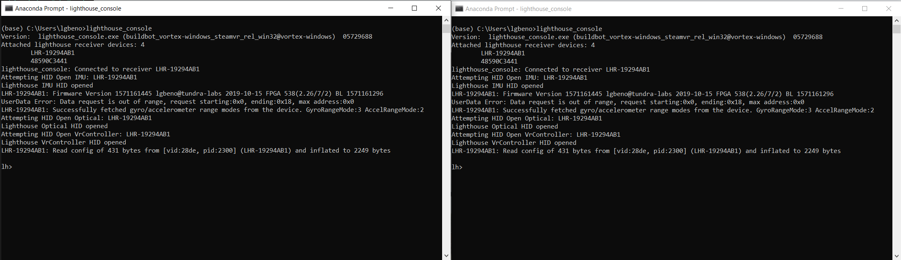
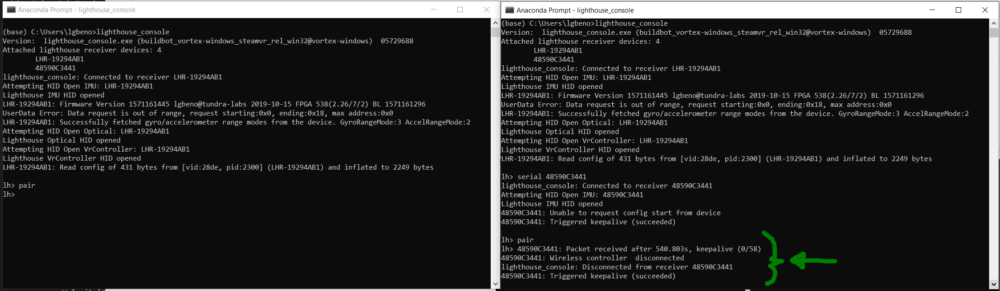

# HDK Pairing Instructions

1. Connect the TL448K6D-GP-HDK to your PC via USB Cable
2. Connect a SteamVR Dongle to the PC
3. Open Two Lighthouse Console Instances:
4.  In the image above, you will see that two Lighthouse devices are available for connection, LHR-19294AB1 and 48590C3441.  Any serial number beginning with “LHR” is a Tracked object device, in this case it is the TL448K6D-GP-HDK.  Serial numbers that do not begin with LHR are typically dongles.  Normally when Lighthouse Console initializes, the first LHR device is connected to by default.
5. In one of the two Lighthouse console windows, type the command “serial <your dongle SN>” to change the connection to the dongle.  In this example “serial 48590C3441” will be used:
6. Now we can see that the left lighthouse console is connected to the LHR device and the right one is connected to the dongle.
7. Type the command “pair” into both consoles
8. when entering Pair on each device, they will both begin the pairing process.  When pairing occurs, the TL448K6D-GP-HDK will briefly connect to the  dongle over wireless and then reconnect via usb.  This is normal and signifies that the pairing process has completed successfully.
9. At this point you may test the wireless connection by disconnecting the TL448K6D-GP-HDK from USB and powering on via battery power.  When you do this, the Left Lighthouse Console will disconnect and the right will establish a full wireless connection.  From this point forward, your TL448K6D-GP-HDK will connect to the dongle via wireless:

